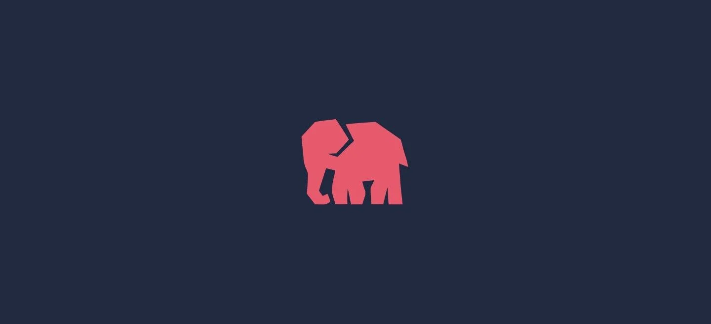

<h1 align="center">Cat Reloaded Backend Circle</h1>

[PHP - Laravel] Track.🐘

## ⭐ PHP 

- [PHP For Beginners](https://laracasts.com/series/php-for-beginners-2023-edition)
- [Mastering PHP](https://www.youtube.com/playlist?list=PLDoPjvoNmBAy41u35AqJUrI-H83DObUDq)

## ⭐ OOP With PHP 

- [Learn Object Oreinted PHP](https://www.youtube.com/playlist?list=PLDoPjvoNmBAxXTPncg0W4lhVS32LO_xtQ)
- [Object Oriented PHP Tutorials](https://www.youtube.com/playlist?list=PL0eyrZgxdwhypQiZnYXM7z7-OTkcMgGPh)

## ⭐ Unified Modeling Language (UML)

- [Unified Modeling Language (UML) ](https://www.youtube.com/playlist?list=PLEFCLObymo052KL2YXBH5MZpusVWWv9WL) -> Arabic
- [Unified Modeling Language (UML) ](https://www.youtube.com/watch?v=WnMQ8HlmeXc&ab_channel=freeCodeCamp.org) -> English

## 🔭 Project

- IN PROGRESS...

## ⭐ Laravel

- [Laravel 8 From Scratch ](https://laracasts.com/series/laravel-8-from-scratch)

## ⭐ SOLID Principles

- [solid principles - learn solid principles in php  ](https://www.youtube.com/watch?v=PDAlpiqISuI&list=PLe_UJpVeP8qBrVwOLpOb9N8T9KvUo3AE6&index=3&t=20s&ab_channel=EraaSoft)

## 🔭 Project

- IN PROGRESS...

## ⭐ API
- [What is REST API?](https://www.youtube.com/watch?v=SLwpqD8n3d0&ab_channel=ProgrammingwithMosh)
- [API For Beginner](https://www.youtube.com/watch?v=TzAJfjCn7Ks&t=378s&ab_channel=CodeWithDary) -> Only basics
- [Laravel API Server Full Course - Beginner to Intermediate](https://www.youtube.com/watch?v=_zNi37BJVBk&ab_channel=Acadea.io) -> Many advanced concepts

## 🔭 Project

- IN PROGRESS...

